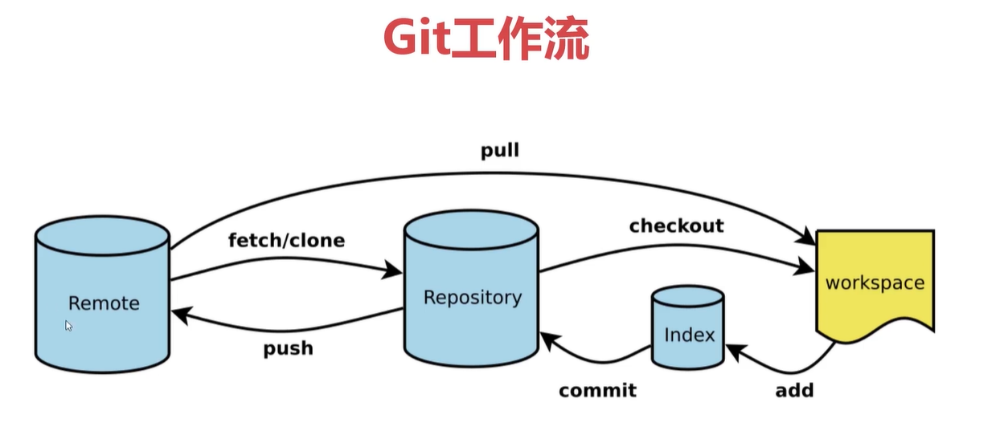

# 一级标题
## 二级标题

一级标题
=======
二级标题
-------

要创建段落，请使用空白行将一行或多行文本进行分隔。   

在一行的末尾添加两个或多个空格，然后按回车键,即可创建一个换行

**粗体**
__粗体__

*斜体*
_斜体_

***粗斜体***
___粗斜体___
__*粗斜体*__
**_粗斜体_**

> 引用
>> 嵌套

1. 列
2. 表
   1. 嵌
   2. 套

- 列
- 表
   - 嵌
   - 套 

* 列
* 表
  
+ 列
+ 表


      我是代码块
      需要缩进4个空格

- 列
  
        在列表需要缩进
        8个空格

- 表

## 图片


[](https://markdown.com.cn)

## 代码
### 代码块
```
code

```

### 将单词或者短语表示为代码

At the command prompt, type `nano`.

### 转义反引号
``At the command prompt, type `nano` ``.

## 分割线
***
---
___

## 超链接
这是一个链接 [makedown语法](https://markdown.com.cn/basic-syntax/links.html)

这是一个链接 [makedown语法](https://markdown.com.cn/basic-syntax/links.html '我是title')

## 转义字符语法
\## 转义字符语法