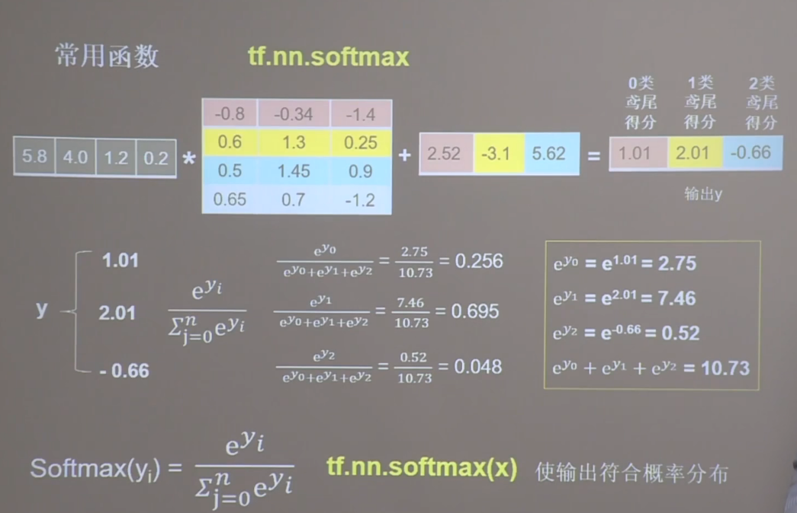

## 常用函数
```
# 强制tensor转换为该数据类型
tf.cast(张量名,dtype=数据类型)

# 计算张量维度上元素的最小值
tf.reduce_min(张量名)

# 计算张量维度上元素的最大值
tf.reduce_max(张量名)

# 指定方向
axis=0代表跨行（经度，down）
axis=1代表跨列(维度，across)
不指定代表所有元素参与

# 计算张量沿指定维度的平均值
tf.reduce_mean(张量名,axis=操作轴)

# 计算张量沿指定维度的和
tf.reduce_sum(张量名,axis=操作轴)

# tf.Variable()将变量标记为可训练，被标记的变量会在反向传播中记录梯度信息
tf.Variable(初始值)

# 四则运算
tf.add, tf.subtract, tf.multiply, tf.divide

# 平方、次方和开方
tf.square, tf.pow, tf.sqrt

# 矩阵乘
tf.matmul

# 切分传入张量的第一维度，生成输入特征/标签对，构建数据集
data = tf.data.Dataset.from_tensor_slices((输入特征,标签))

# with结构记录计算过程，gradient求出张量的梯度
with tf.GradientTape() as tape
    若干个计算过程
grad=tape.gradient(函数, 对谁求导)

# enumerate可以遍历每个元素（如列表、元组或字符串），组合为：索引 元素，常在for循环中使用
enumerate(列表名)

# 独热编码:在分类问题中，常用独热码做标签（1：是，0：非）
tf.one_hot(待转换数据,depth=几分类)

# 使得输出符合概率分布
tf.nn.softmax(x)

# 赋值操作，更新参数的值并返回
# 调用assign_sub前，先用tf.Variable定义变量w为可训练（可自更新）
w.assign_sub(w要自减的内容)

# 返回张量沿指定维度最大值的索引
tf.argmax(张量名,axis=操作轴)
```


