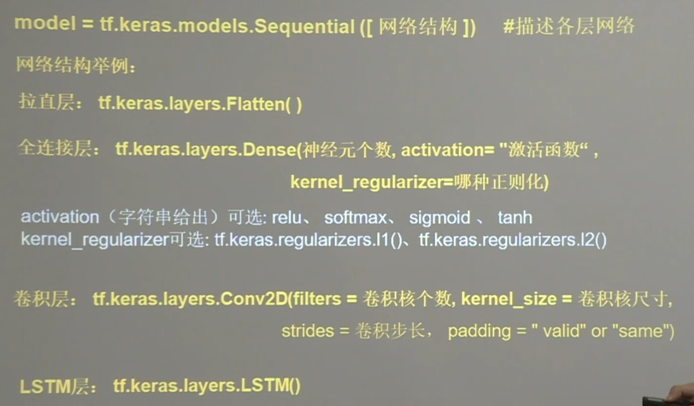
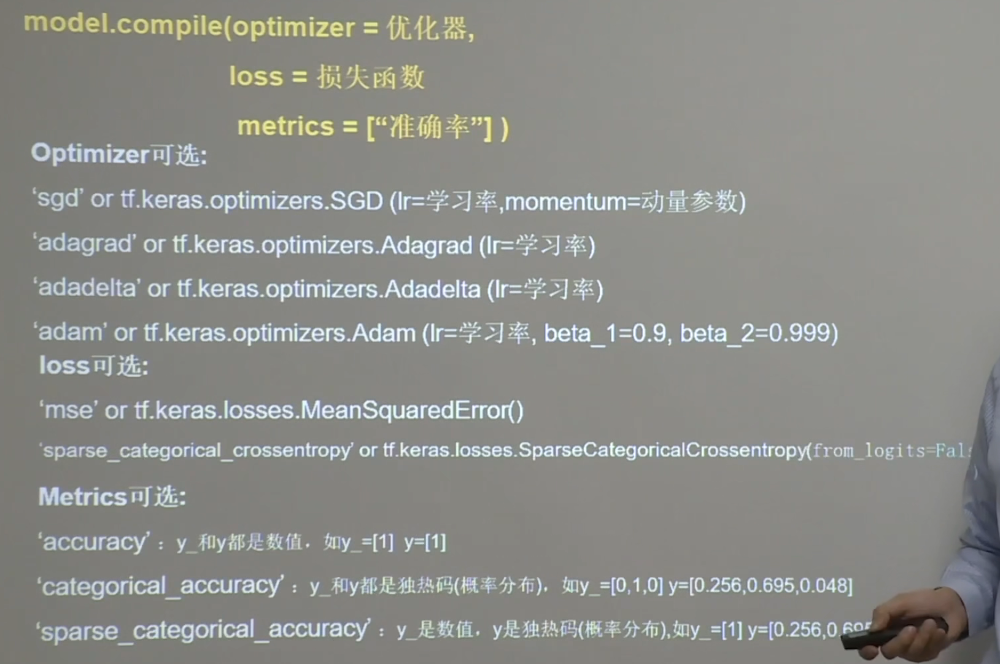
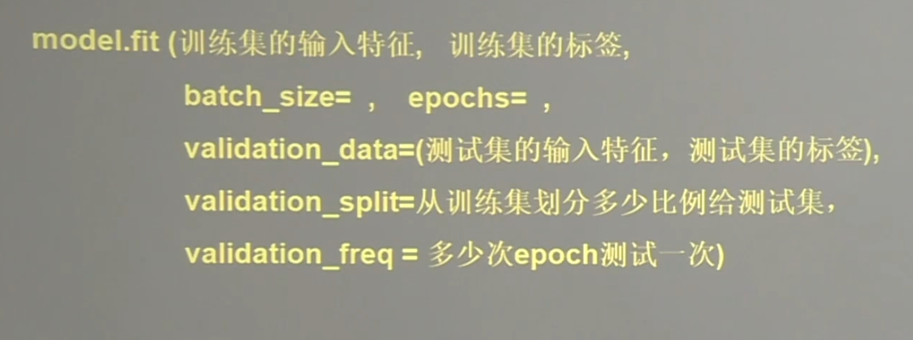
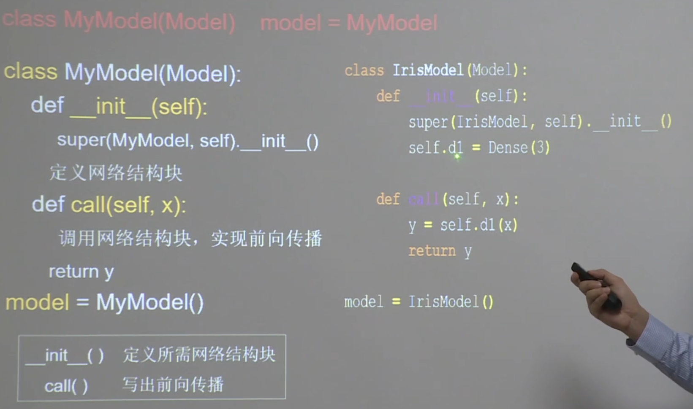

## tf.keras搭建网络八股（六步法）
- import
- train, test
- model = tf.keras.models.Sequential
- model.compile
- model.fit
- model.summary
上层输入就是下层输入的顺序网络结构，无法写出一些带有跳连的非顺序网络结构（上层输入是下几层的输入）
### Sequential

### compile

激活函数使用softmax使输出是概率分布，from_logits选False
### fit

## 搭建网络八股class（六步法）
- import
- train, test
- class MyModel(Model) model=MyModel
- model.compile
- model.fit
- model.summary
