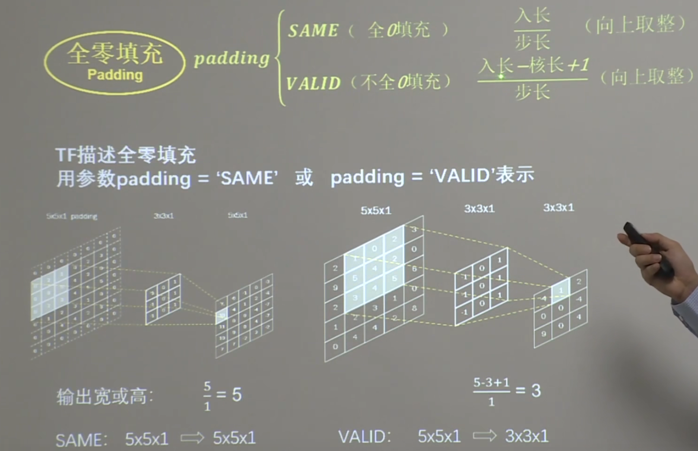
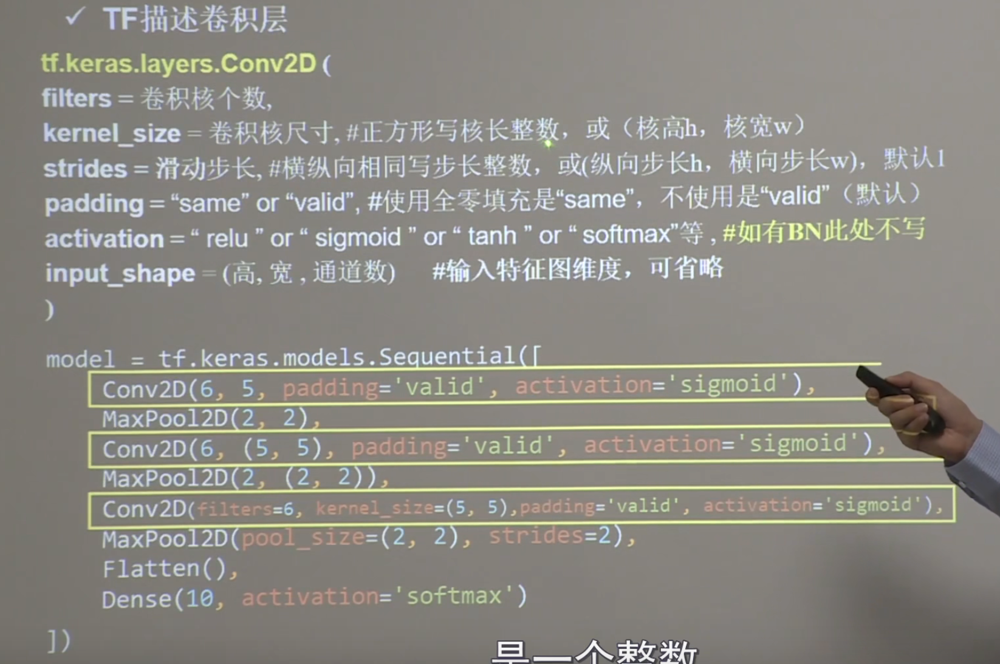
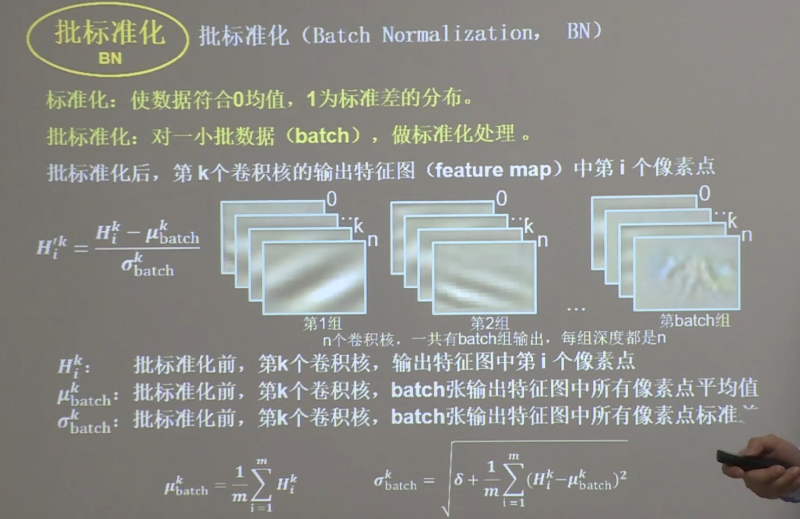
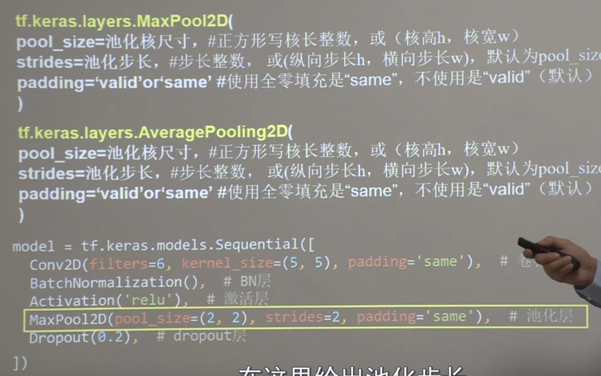

## 卷积神经网络的主要模块
- 卷积
- 批标准化（BN）
- 激活
- 池化
- 全连接

## 卷积
- 输入特征图的深度（channel数），决定了当前层卷积核的深度
- 当前层卷积核的个数，决定了当前层输出特征图的深度

## 感受野（Receptive Field）
卷积神经网络各输出特征图中的每个像素点，在原始输入图片上映射区域的大小

两层3 *3的卷积核和一层5 *5的卷积核输出的感受野大小都是5
- 两层3 * 3计算量9 * (x-2)^2+9 * (x-4)^2
- 一层5 * 5计算量25 * (x-4)^2

## 全零填充(padding)

## TF描述卷积层

## BN(batch normalization批标准化)

## 池化(pooling)
用于减少特征数据量
最大值池化可提取图片纹理，均值池化可以保留背景特征

## 舍弃(Dropout)
在神经网络训练时，将一部分神经元按照一定概率从神经网络中暂时舍弃。神经网络使用时，被舍弃的神经元恢复链接

## 经典训练网络
- LeNet
- AlexNet
- VGGNet
- InceptionNet
- ResNet
